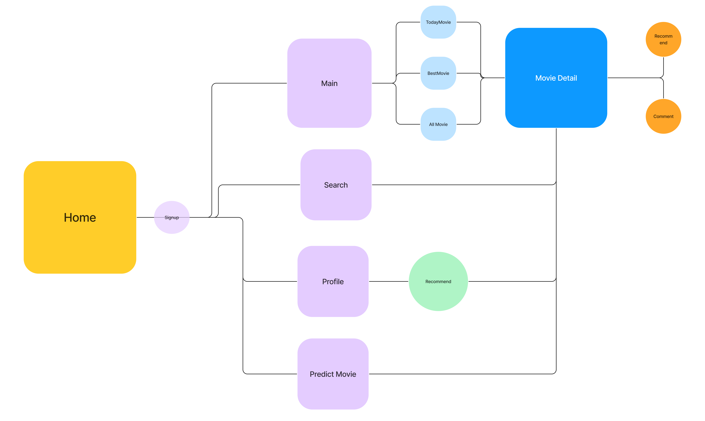

# WYW 영화 추천 서비스

- 기간 : 2023/05/18 - 2023/05/26
  공휴일 제외 7일 간 프로젝트 진행

---

## 구성원

- 팀장 : 유진욱
  - Back-end
- 팀원 : 박도현
  - Front-end
- 서로 주로 맡은 파트의 코드 작성을 담당 및 피드백
- 부족한 부분에 대하여 협업 진행

---

## 목차

- 목표 서비스
- 서비스
  - 영화 추천
    - 좋아요를 기반으로 한 추천
    - 기존 영화를 바탕으로 한 추천
  - Actor 정보를 기반으로 한 영화 Revenue 계산
  - 영화 검색 및 정보 제공
    - Today movie & Best movie 에 대한 정보 제공
    - 영화 검색 기능을 통해 영화 정보 제공
- Back end
  - ERD 구조
- 영화 추천 알고리즘
- Front end
  - webpage 구성

---

## 목표

#### 서비스

- 영화 제작자들 혹은 커뮤니티 이용자들을 위한 영화 관련 데이터를 기반으로 한 Revenue 예측 서비스
  - 영화 출연진 및 제작진, 영화 제작사, 영화 개봉 시기 등의
    특정 데이터를 고려한 영화 Revenue 예측 서비스
- 영화 정보 제공 커뮤니티
  - 영화 정보 제공 뿐 아니라, 좋아요 및 댓글 기능 등
    영화 정보 제공 외의 기능 제공
- 영화 추천 서비스
  - 커뮤니티 이용자가 선호하는 영화를 기반으로 한 추천 알고리즘을 통해 영화 추천 서비스
  - 정보 제공 서비스를 통해 현재 찾은 영화를 기반으로 하여 관련 영화 추천 알고리즘을 통한 서비스

---

## 서비스

- 영화 추천
  
  - 기존에 커뮤니티를 이용하는 사용자가 ‘좋아요’ 를 클릭한 영화 데이터를 기반으로 영화 추천
  - 검색을 통해 찾은 영화 정보를 기반으로 영화 추천

- Actor 정보를 기반으로 한 영화 Revenue 계산
  
  - 유명 영화 출현 배우의 revenue 정보를 바탕으로, 최소 1명 최대 4명의 Actors가 제공 해주는 데이터를 기반으로 한 영화 제작 시 Revenue 계산 알고리즘과 이를 통한 결과 값 제공

- 영화 검색 및 정보 제공
  
  - 현재 개봉한 Today Movie 와 TNDB에서 제공하는 Popularity를 기반으로 한 가장 인기 있는 Best Movie 정보 제공
  - 간단한 영화 검색 기능과 이와 더불어 영화 상세 정보 제공

---

## ER Diagram

---

## 

## 주요 기능 및 알고리즘

#### 1. 영화 추천 알고리즘

- Vue에서 선택된 영화(Detail or like) 데이터를 Django로 넘겨준다.

- 영화의 줄거리를 TF-IDF (Term Frequency-Inverse Document Frequency) 알고리즘을 활용하여 단어의 빈도와 역 문서의 빈도를 분석하여 각 단어들마다 중요한 정도에 따라 가중치를 부여하는 matrix를 만든다.

- 부여된 가중치를 기반으로 줄거리들의 cosine similarity matrix를 만들고 Vue에서 받은 데이터에 대하여 유사도가 가장 높은 상위 10개의 영화를 추천한다.

- like의 경우 여러 list형태로 다양한 영화를 제공하기 때문에 overview를 합쳐 TF-IDF와 cosine similarity를 활용하여 유사도가 높은 영화중 랜덤한 10개를 추천한다.

#### 2.  매출(revenue) 예측 알고리즘

- Vue에서 선택된 배우 데이터를 Django로 넘겨준다.

- 선택된 배우들이 참여한 영화 데이터를 기반으로 배우 별 revenue와 popularity 데이터를 생성한다.

- revenue에 popularity를 활용하여 가중 평균(Weighted Mean)으로 매출액을 예측한다.

#### 3. 오늘의 영화 (Today movies)

- 00시가 지난 후 Vue를 통해 DJango의 URL에 접근하면 자동으로 데이터를 갱신하여 local에 있는 fixtures폴더의 금일 날짜를 기준으로 금일 한국에서 상영하고 있는 영화 데이터를 출력하여 보여줍니다.

#### 4. Best Movie

- TMDB에서 제공하는 popularity를 기반으로 가장 인기있는 10개의 영화를 추천한다.

#### 5. 영화 검색

- 검색창에 입력한 데이터를 v-model로 받아 TMDB의 API에 보내면 입력한 데이터가 포함된 모든 영화를 응답받아 포스터를 출력한다.

- 포스터를 누를 시 DB에서 해당 영화를 가져와 Detail을 출력한다.

---

## Vue기반 웹 페이지 구조

---

## 느낀점 및 개선 사항

#### 유진욱

- 목표를 세우는 것과 목표에 맞는 모든 기능들을 수행하는 데에는 이상치를 바라보는 것도 좋지만 수행할 수 있는 양의 적절한 목표를 세우는 것이 중요하다는 것을 다시 한 번 깨닫게 되었다.

- 부족한 부분을 채워 넣는 것보다 많은 곳으로 손을 뻗어 완성도가 떨어지는 부분들이 생긴 것에 대하여 원인과 이유를 분석하여 개선해 나아가야 한다.

- Vue.js와 Django를 함께 다루고 팀원과 피드백하는 과정을 통해 front에서의 고됨과 back에서의 고됨을 양측에서 파악하는 계기가 되었다.

- 앞서 부족한 부분에 대하여 보완하는 과정을 추가 학습으로 진행하고자 하며 앞으로의 프로젝트에서 완성도 높은 프로젝트를 만들고자 한다.

- 부족했던 부분
  
  - model
    - 일단 여러가지를 해보고자 하는 것으로 인하여 프로젝트가 마무리되는 날까지도 사용하지 않은 feature들을 만들어 DB의 무게를 무겁게 했다.
    - get_user_model, dj_rest_auth 등에 대한 이해가 부족함을 충분히 느꼈다.
  - ERD
    - 프로젝트를 시작할 때 ERD를 구성하고 추가적인 부분에 대하여 1:1, 1:N, N:M 구조를 확실하게 가져가지 않았다.
  - serializer
    - model과 마찬가지로 만들어두고 사용하지 않은 부분에 대하여 처리를 하지 못한 것에 시간 소요가 많았다.
  - views, common
    - python 파일들에 만들어둔 함수들을 활용하여 views에서 클린한 코드를 작성하지 못했다.
  - algorithm
    - 구성하고자 하는 알고리즘은 많았으나 완성도가 높지 못했다.

- 앞선 부분들을 보완하기 위해 코드를 다시 확인하며 넓게 손뻗었지만 완성하지 못했거나 사용하지 못한 부분들을 채울 것이다.

- 이번 프로젝트에서 진행하지 못한 django, vue.js의 배포 과정에 대하여 추가 학습이 필요하다.

- Front에서의 고됨을 파악하고 이를 back에서 해결에 도움을 주기 위한 클린 코드 및 알고리즘 모델 등을 만드는 것을 이번 프로젝트의 마무리로 하고자 한다.

#### 박도현

- 느낀 점 및 부족한 점
  - 기획이 부족한 사항에서 시작하여 중간에 수정 사항이 많이 존재하였고 이를 수정하는데 상당 시간이 소요되었으므로 처음부터 철저히 계획하고 상당 시간을 잡고 기획을 하고 프로젝트를 진행하는 것이 중요하다고 느꼈다.
  - 다양한 기능을 제공하기 시간을 소모하여 완성시키기 보다는 기초적인 기능의 완성이 선행되고 이후 다른 기능을 완성시키는 것이 중요하다고 느꼈다.
  - 특정 파트를 담당하더라도 프론트 뿐 아니라 백엔드에서 Flow 또한 파악할 수 있어야 어느 부분에서 오류가 발생했는지 금방 파악 할 수 있다고 느꼈다.
  - 진행 속도에 대한 계산을 잘 하지 못하여 결과물을 완벽히 완성시키지 못했음
- 개선점
  - django의 코드를 정확히 학습하여 django에 대해 전체적으로 이해하는 것이 좋다고 느꼈고 이를 개선해야함
  - vue에서 다른 처리 방법이 있음에도 기존에 미흡한 점이 있어 이러한 방법을 몰랐으므로 향후 이에 대해 개선해야 함
  - 프로젝트 결과물 배포해보기
  - 기획을 확실히 하여 향후 프로젝트 진행